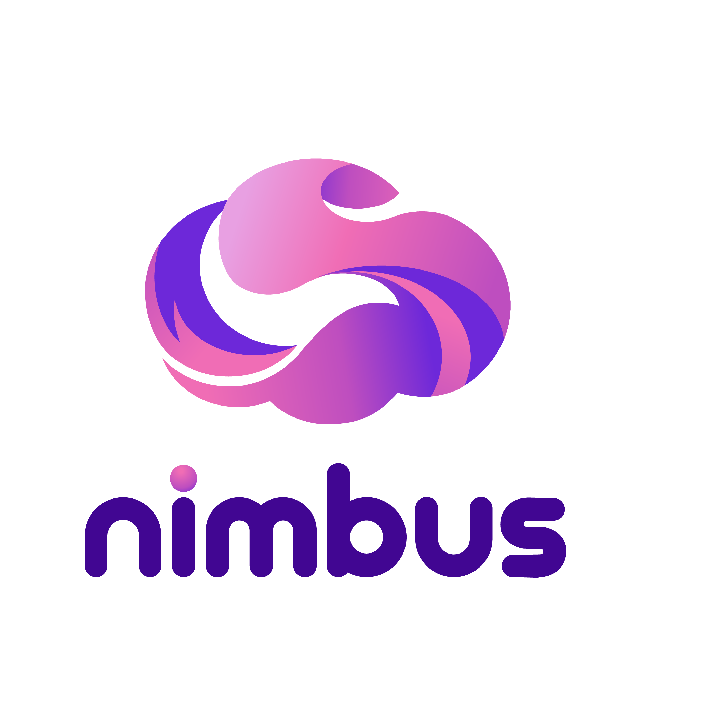
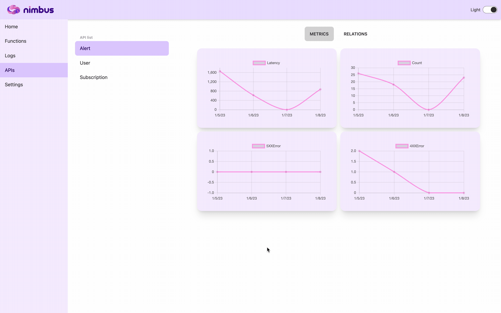
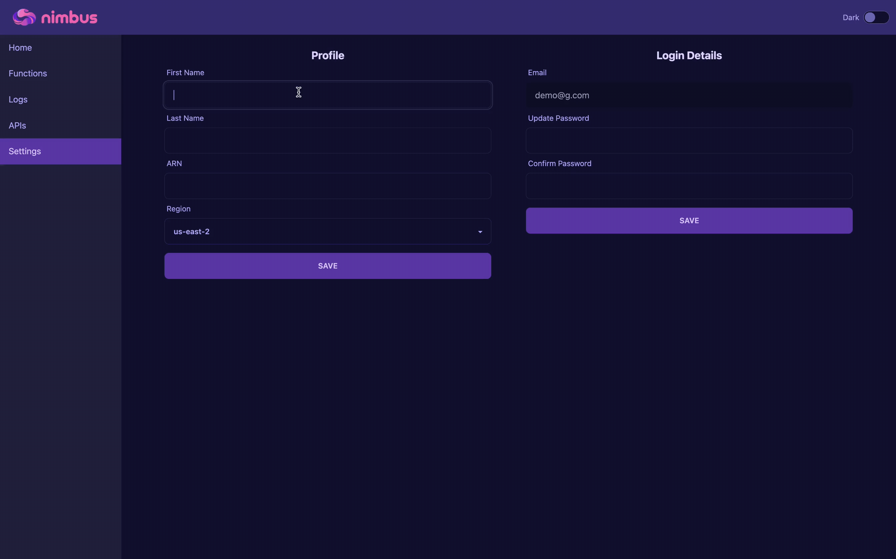
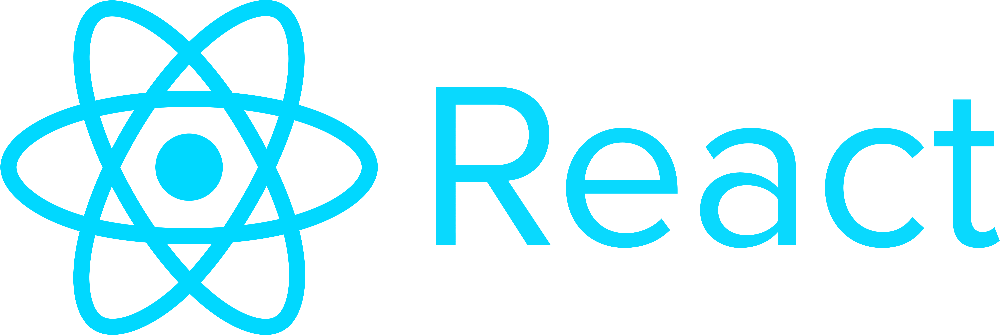
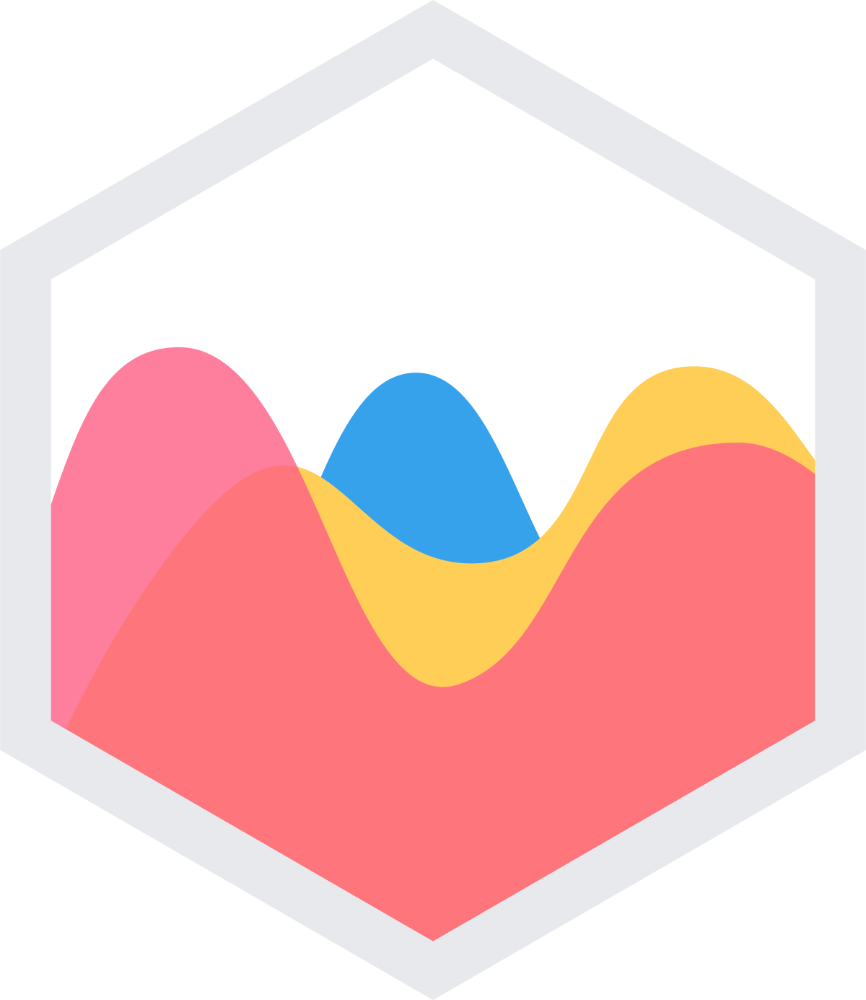
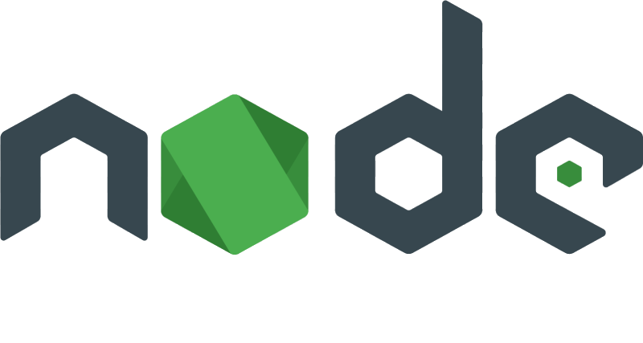

<h1 align="center">
  <br>
    
  <br>
  AWS Lambda Performance Tool
  <br>
</h1>


### About Nimbus
Serverless architecture has become very popular in the field of software engineering, and Amazon's launch of AWS Lambda in 2014 has been a big part of its growth. AWS Lambda is a serverless computing service that lets users run code in response to events like changes to a DynamoDB table, an API call to API Gateway, or the addition of a file to an S3 bucket. As a function-as-a-service (FaaS) offering, AWS Lambda allows developers to focus on the business logic of their applications by abstracting away the underlying server infrastructure, such as maintenance, capacity planning, and scaling

AWS Lambda is a well-known service for serverless computing that lets users run code when certain events happen. But it can be hard to keep track of how well your Lambda functions are working and how they are being used, especially if you have a lot of functions and triggers or are running complex workloads. This is where Nimbus comes in. Nimbus is a desktop app that aims to solve this problem by making it easy to connect to your AWS account and keep an eye on the metrics of your Lambda functions. With Nimbus, you can see information about how your functions are being used and how well they are working in real time. This includes the number of function calls, how long each call took, and any errors or throttles that happened. Nimbus also gives you an estimate of how much your function calls will cost, so you can keep track of how much you're spending. In short, Nimbus is a valuable tool that simplifies the process of monitoring your AWS Lambda functions.

Nimbus is a tool for monitoring, but it also has a number of features that make your AWS experience better. For example, Nimbus lets you look at and analyze the logs that your lambda functions create. This can help you solve problems and find ways to improve your code. Nimbus also allows you to monitor resources within your AWS API Gateway. It shows important API metrics like the number of calls, 4xx errors, 5xx errors, and latency. It also shows the lambda function that is connected to each endpoint. This makes it easy to see everything about your serverless app


### Installation
Download the desktop application HERE

### User Guide
- Visit the landing page and download the app for your operating system. Install it on your computer to get started.

- Create an account by entering your information and linking it to your AWS account following the instructions provided on the Register page.


- If you already have an account, simply log in.


On the home page, you'll find a lot of information about the health of your AWS application, especially as it relates to lambda functions. This includes important metrics like the number of calls, errors, throttles, costs, and runtimes.

- Head over to the Functions tab to see metrics broken down by individual functions, including invocations, errors, throttles, and durations.


- The Logs tab is where you can find all your lambda function logs and filter them by time period, reports only, errors only, or any keyword.


- The APIs tab lets you view common API metrics, endpoints, and the lambda functions they're connected to.



- In the Settings tab, you can update your personal information (including AWS Cloudformation Stack ARN and region) or change your login details.




### Technologies Used

<!-- FRONT END -->
<a href="#"></a> <br>
<a href="#"></a> <br>
<p> Chart JS </p>
<a href="#"></a> <br>
<a href="#"></a> <br>
<a href="#"></a> <br>

<!-- BACK END -->
<a href="#"></a> <br>
<a href="#"></a> <br>
<a href="#"></a> <br>
<a href="#"></a> <br>
<a href="#"></a> <br>
<a href="#"></a> <br>
<a href="#"></a> <br>


### How To Contribute 
Nimbus is an open-source product supported by the tech accelerator OS Labs. We welcome and appreciate contributions from the community. If you are interested in contributing to the development of our AWS serverless component monitoring and visualization tool, here are a few ways to get started:

1. <b> Fork the repository: </b> Go to the <a href="https://github.com/oslabs-beta/nimbus"> main repository </a> on GitHub and click the “Fork” button to create a copy of the code under your own account. This will allow you to make changes to the code without affecting the original repository.
2. <b> Set up your development environment: </b> 
  - To install the dependencies configured in the package.json file, run the following command:
  ```
  npm install
  ```
  - To set up a MongoDB database, you will need to obtain a connection string. Once you have the connection string, create an ENV file in the root directory and input the connection string as follows:
  ```
  MONGO_URI='your_connection_string'
  ```
  - Next, input your desired port number in the ENV file:
  ```
  PORT=your_port_number
  ```
  - The Nimbus application requires the use of JWT tokens for implementation, so you will need to create tokens for this purpose. You can input these tokens in the ENV file as follows:
  ```
  ACCESS_TOKEN_SECRET=your_access_token_secret
  REFRESH_TOKEN_SECRET=your_refresh_token_secret
  ```
  - Finally, you will need to obtain the access key id, secret key, and region from your AWS IAM account. Input these values in the ENV file as follows:
  ```
  AWS_ACCESS_KEY_ID=your_access_key_id
  AWS_SECRET_KEY=your_secret_key
  AWS_REGION=your_region
  ```
3. <b> Choose an issue to work on: </b> Browse the <a href="https://github.com/oslabs-beta/nimbus/issues"> open issues </a> in the repository and pick one that interests you. Alternatively, you can also propose your own changes by opening a new issue and describing the feature or improvement you would like to see.
4. <b> Create a branch: </b> Once you have chosen an issue to work on, create a new branch in your fork of the repository. Name the branch something descriptive, such as “add-feature-x” or “fix-bug-y”. This will allow you to work on your changes without affecting the main branch of the repository.
5. <b>  Make your changes: </b> Make the necessary changes to the code in your branch. Be sure to follow the repository’s style guidelines and best practices, and make sure to test your changes thoroughly before submitting them.
6. <b> Commit and push your changes: </b> Once you are satisfied with your changes, commit them to your branch and push them to your fork of the repository.
7. <b> Open a pull request: </b> Go to the main repository on GitHub and click the “Compare & pull request” button. Describe the changes you have made and why they are necessary. Then, submit the pull request for review.

A member of the repository’s maintainer team will review your pull request and either merge it into the codebase or provide feedback for changes that need to be made. Thank you for considering contributing to our project!


### License
Distributed under the MIT License

### Meet The Team
* Madeline Doctor - <a href="https://www.linkedin.com/in/madeline-doctor/" target="_blank"> LinkedIn </a> | <a href="https://github.com/madelinedoctor1"> GitHub </a>

* Arturo Kim -  <a href="https://www.linkedin.com/in/arturokim/" target="_blank"> LinkedIn </a> | 
<a href="https://github.com/arturokim"> GitHub </a>

* Georges Maroun -  <a href="https://www.linkedin.com/in/georges-m/" target="_blank"> LinkedIn </a> | <a href="https://github.com/george-maroun"> GitHub </a>

* Arthur Su -  <a href="https://www.linkedin.com/in/arthursu/" target="_blank"> LinkedIn </a> | 
<a href="https://github.com/suster22"> GitHub </a>

* Zhaowei Sun -  <a href="https://www.linkedin.com/in/zhaowei-sun/" target="_blank"> LinkedIn </a> | 
<a href="https://github.com/zhaowei-sun"> GitHub </a>


